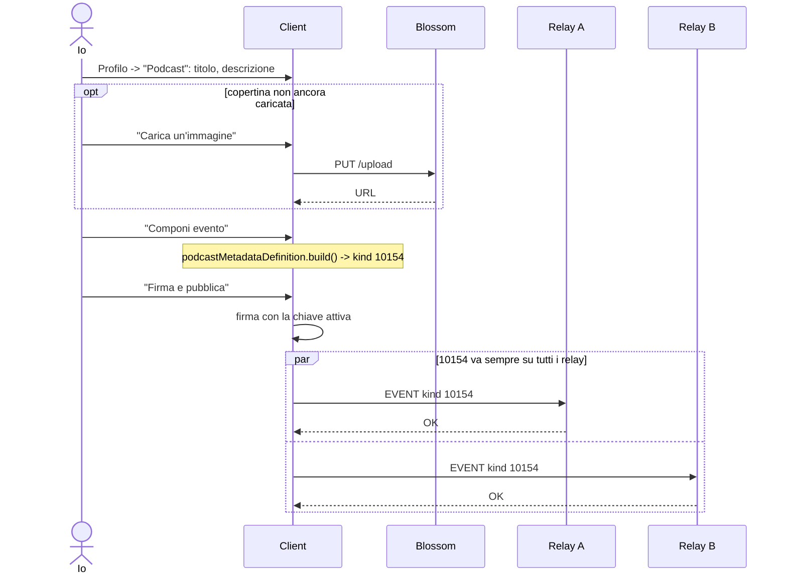
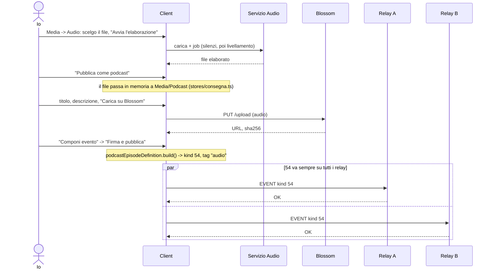
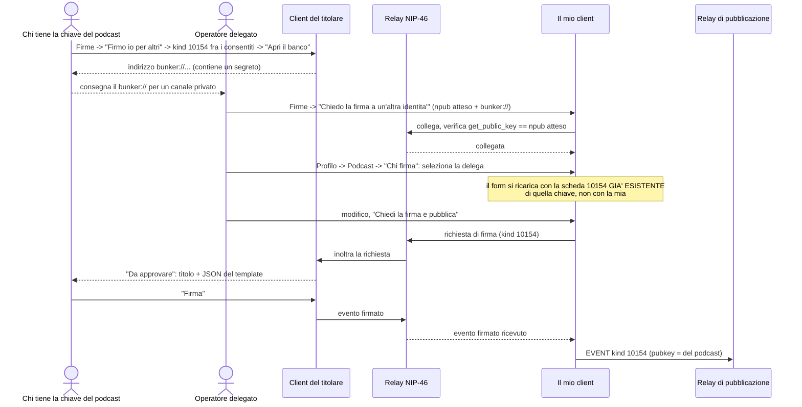
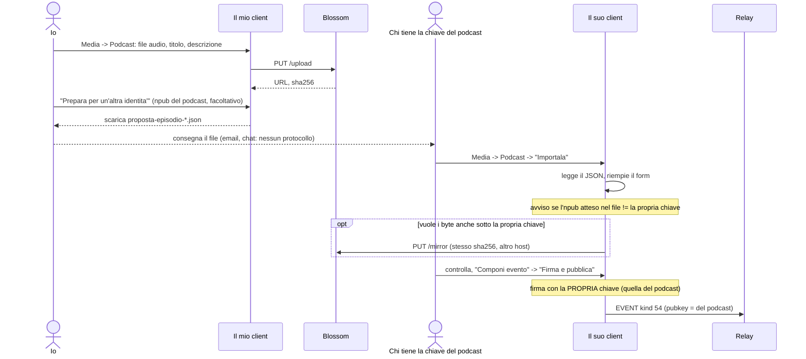
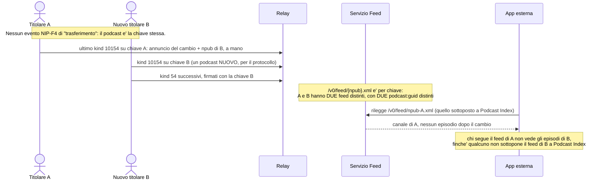

# Podcast su Nostr (NIP-F4): guida del client

Cosa il client sa fare oggi con i kind 54, 10154 e 10064, e come si comportano
i sei casi che contano davvero: pubblicare un podcast o un episodio propri,
pubblicarne uno che non è il tuo, farlo per conto di un terzo, e — il caso che
il protocollo non prevede — trasferirne la proprietà.

Non è un tutorial passo-passo sui pulsanti: per quello vale la UI stessa, che
spiega ogni scelta lì dove si fa. Questo documento serve a chi deve capire
**come i pezzi si incastrano**, e dove smettono di incastrarsi.

## Il modello: perché il podcast è una chiave

NIP-F4 non ha un concetto di "show" separato da un'identità Nostr: **ogni
podcast è una coppia di chiavi a sé**. Pubblicare un episodio con la propria
identità personale significa che quell'identità _diventa_ il podcast — non
c'è un livello intermedio, non c'è un campo "pubblicato per conto di". Chi
firma l'evento è, agli occhi del protocollo, l'autore.

Questa scelta di design ha una conseguenza che percorre tutto il resto del
documento: **tutto ciò che assomiglia a "gestire un podcast insieme ad altri"
o "passarne la proprietà" è un problema di firma**, non un problema di dati.
La domanda da porsi, in ogni caso d'uso, è sempre la stessa: _quale chiave
deve comparire come `pubkey` sull'evento, e come si ottiene che sia quella la
chiave firmante?_

## I tre kind

| Kind      | Nome NIP-F4                | Classe                | Cosa dice                                                                                            | File                                                                    |
| --------- | -------------------------- | --------------------- | ---------------------------------------------------------------------------------------------------- | ----------------------------------------------------------------------- |
| **54**    | episodio di podcast        | regolare (immutabile) | un episodio: titolo, descrizione, immagine, una o più sorgenti `audio` (url + MIME, **non** `imeta`) | [`podcast.ts`](../packages/nostr-core/src/kinds/definitions/podcast.ts) |
| **10154** | scheda del podcast         | replaceable           | la scheda dello _show_: titolo, descrizione, immagine, siti, autori dichiarati (`p` con ruolo)       | stesso file                                                             |
| **10064** | podcast di cui si è autori | replaceable           | pubblicato dall'**autore**, sulla **sua** chiave: elenca gli show a cui dichiara di collaborare      | stesso file                                                             |

Il 10154 e il 10064 sono le due metà dello stesso riscontro: il 10154 dice
_"questi sono i miei autori"_, il 10064 dice _"io collaboro con questo show"_.
NIP-F4 lo dice esplicitamente — un podcast può attribuirsi chiunque nei suoi
`p`, quindi quell'elenco da solo non prova nulla; è il 10064 pubblicato
dall'autore, sulla sua chiave, a dare un riscontro indipendente.

Tre vincoli che il client applica e che vale la pena conoscere prima di
leggere i casi d'uso:

- **descrizione e immagine sono obbligatorie**, sia per l'episodio sia per la
  scheda — non lo impone NIP-F4 alla lettera, ma senza non c'è nulla da
  mostrare in un lettore di podcast, e il client li chiede prima di lasciare
  che l'errore arrivi da un relay.
- **l'audio si dichiara con il tag `audio`, non con `imeta`**: niente hash,
  niente dimensione. Chi ascolta non può verificare che il file sia quello
  pubblicato — è la specifica a volerlo così, il client lo dice in pagina
  invece di correggerlo.
- **10154 e 10064 vanno sempre su tutti i relay di scrittura**, qualunque
  strategia tu abbia scelto nelle impostazioni — come le note **no**. Un
  lettore di podcast legge da un relay suo e non chiede al client dove ha
  pubblicato: se la scheda finisce su un relay solo, per chi legge da un
  altro relay il podcast semplicemente non esiste. La regola sta nel core
  (`strategiaPerKind`, [`relays/publish.ts`](../packages/nostr-core/src/relays/publish.ts))
  e vale anche per il profilo e le altre liste.

## Dove si fa, nel client

| Cosa                                           | Pagina                                 | Kind coinvolto                                   |
| ---------------------------------------------- | -------------------------------------- | ------------------------------------------------ |
| Scheda del podcast (propria identità)          | _Profilo → Podcast_                    | 10154                                            |
| "Sono autore di questo podcast"                | _Profilo → Podcast di cui sono autore_ | 10064                                            |
| Pre-elaborare un audio (silenzi, livellamento) | _Media → Audio_                        | — (non pubblica nulla da sé)                     |
| Caricare e pubblicare un episodio              | _Media → Podcast_                      | 54                                               |
| Bozze di episodio lasciate a metà              | _Media → Podcast_ (elenco in testa)    | 54                                               |
| Concedere/chiedere una firma delegata (NIP-46) | _Firme_                                | qualunque kind delegabile, 54 e 10154 di default |
| Verificare il feed RSS e scaricarlo come OPML  | _Profilo → Feed RSS_ (sotto la scheda) | derivato da 54 + 10154                           |

## Due modi di far firmare un'altra chiave

Ogni caso d'uso che coinvolge più di un'identità passa da uno di questi due
meccanismi. Non sono intercambiabili: risolvono situazioni diverse.

|                       | Proposta esportabile                                                                                                                                             | Delega NIP-46                                                                                                                                                                     |
| --------------------- | ---------------------------------------------------------------------------------------------------------------------------------------------------------------- | --------------------------------------------------------------------------------------------------------------------------------------------------------------------------------- |
| **Modello**           | Un file JSON: dati del form + descrittori dei file già su Blossom. Non è un evento, non è firmato.                                                               | Un vero e proprio _bunker_ remoto: chi tiene la chiave apre una sessione in ascolto su un relay d'incontro.                                                                       |
| **Sincronia**         | Asincrona: si scarica, si consegna per qualunque canale (email, chat), si importa quando capita.                                                                 | Sincrona: chi chiede la firma e chi la concede devono avere entrambi il client aperto nello stesso momento (la richiesta scade dopo 3 minuti).                                    |
| **Chi firma davvero** | Chi **importa** il JSON: ricompone dal form ciò che vede e firma con la propria sessione. Non gli arriva mai un evento già impacchettato da qualcun altro.       | Chi tiene la chiave, dal _banco_ — approva o rifiuta ogni richiesta, evento per evento.                                                                                           |
| **Copre quali kind**  | Solo il **54** (episodio): `esportaProposta` / `importaProposta` sono nel modo "podcast" di _Media → Podcast_.                                                   | Quelli scelti nel banco. Di default 54 e 10154 ([`KIND_RICHIESTI`](../apps/web/app/stores/deleghe.ts), [`KIND_PREDEFINITI`](../apps/web/app/stores/banco.ts)).                    |
| **Revocabile**        | N/A — è un file, non un permesso.                                                                                                                                | Sì: chi tiene la chiave chiude il banco o rifiuta le richieste da lì in avanti.                                                                                                   |
| **File**              | [`episodi/index.ts`](../packages/nostr-core/src/episodi/index.ts) (`BozzaEpisodio`), UI in [`CaricaMedia.vue`](../apps/web/app/components/media/CaricaMedia.vue) | [`signers/{bunker,delega}.ts`](../packages/nostr-core/src/signers/), UI in [`firme.vue`](../apps/web/app/pages/firme.vue), [`stores/{banco,deleghe}.ts`](../apps/web/app/stores/) |

Nota che manca una riga: **non esiste una proposta esportabile per il 10154**.
Aggiornare la scheda di un podcast che non si possiede è possibile _solo_ per
delega, mai in modo asincrono. È elencato in fondo, fra le cose non coperte.

---

## Caso 1 — Pubblico un mio podcast

La forma più semplice: la scheda dello show sulla propria identità.



Ripubblicare (`Componi evento` di nuovo, con dati diversi) **sostituisce** la
versione precedente: 10154 è replaceable, non si accumula.

## Caso 2 — Pubblico un mio episodio

Il percorso completo, con la pre-elaborazione audio come passo facoltativo ma
integrato: l'audio elaborato arriva già nel modo giusto, senza scaricarlo e
ricaricarlo a mano.



Si può anche partire direttamente da _Media → Podcast_ con un file già pronto,
saltando la pagina Audio. E in qualunque momento, prima di "Componi evento",
**"Salva come bozza"** mette via il lavoro — utile se manca ancora un dato,
tipicamente l'immagine dell'episodio.

## Caso 3 — Pubblico un podcast di altri

"Di altri" qui significa: la scheda (10154) deve uscire con la `pubkey` di
un'identità di cui **non** possiedo la chiave privata. L'unico modo che il
client offre è la delega NIP-46 — non esiste una proposta esportabile per
questo kind.



Un dettaglio che conta: scegliendo la delega in _Profilo → Podcast_, il form
**non parte vuoto e non parte dal mio profilo** — va a cercare sui relay
l'ultima scheda pubblicata da quella chiave (`perCoordinata(10154, undefined,
pubkeyDelegata)`) e la carica per modificarla. Se quella chiave non ha ancora
una scheda, il form è vuoto e la prima pubblicazione la crea.

## Caso 4 — Pubblico un episodio di altri

Stessa domanda del caso 3, applicata al kind 54. Qui però esiste anche la via
asincrona, ed è quella mostrata: chi prepara l'episodio non deve essere online
insieme a chi possiede la chiave.



L'alternativa sincrona esiste ed è identica, nello scheletro, al caso 3: da
_Media → Podcast_, con una delega attiva, il campo "Chi firma" e il pulsante
diventa "Chiedi la firma e pubblica". Si sceglie l'una o l'altra in base a se
chi possiede la chiave è raggiungibile nello stesso momento.

## Caso 5 — Pubblico un episodio di altri per conto di altri

Qui gli attori sono **tre**: chi fornisce il materiale (una persona che può
non usare affatto questo client — un ospite che manda un audio per email),
chi lo carica e lo impacchetta, e chi possiede la chiave del podcast e firma.
Tecnicamente è lo stesso meccanismo del caso 4; la differenza è che
"prepara" e "vuole che venga pubblicato" sono due persone diverse.

```mermaid
sequenceDiagram
    actor Richiedente as Persona B
    actor Operatore as Io
    participant MioClient as Il mio client
    participant Blossom
    actor Titolare as Chi tiene la chiave del podcast
    participant SuoClient as Il suo client
    participant Relay

    Richiedente-->>Operatore: file audio e note, per un canale qualunque
    Operatore->>MioClient: Media -> Podcast: carico, titolo, descrizione
    MioClient->>Blossom: PUT /upload
    Blossom-->>MioClient: URL, sha256
    Operatore->>MioClient: "Prepara per un'altra identita'" (npub del podcast)
    Note over MioClient: preparataDa = il MIO npub (chi ha impacchettato).<br/>Il legame con B resta informale: non entra nell'evento firmato.
    MioClient-->>Operatore: proposta-episodio-*.json
    Operatore-->>Titolare: consegna la proposta
    Titolare->>SuoClient: "Importala", controlla, "Firma e pubblica"
    SuoClient->>Relay: EVENT kind 54 (pubkey = del podcast; nessun riferimento a B)
```

**Onestà su un punto che conta**: il campo `preparataDa` della proposta è
informativo e locale — vive nel file JSON, non nell'evento pubblicato, e
riporta chi ha _impacchettato_ la proposta (l'operatore), non chi ha
_fornito_ il contenuto originale (Persona B). Se il credito verso B deve
comparire da qualche parte in modo verificabile, l'unico posto protocollare è
dentro il contenuto dell'episodio stesso (il `content`, in Markdown) o, se B
collabora stabilmente, come autore nel 10154 — riscontrato dal suo 10064.
Non c'è un modo automatico di dire "pubblicato da X per conto di Y" su Nostr,
perché un evento ha una `pubkey` sola.

## Caso 6 — Trasferisco la proprietà di un podcast

Qui la risposta onesta è: **NIP-F4 non lo prevede**, perché non c'è nulla da
trasferire a livello di dati — il podcast _è_ la chiave, e una chiave o la si
possiede o non la si possiede. Non esiste un evento "cambio di proprietario"
né un tag "moved to" come esiste per altri usi su Nostr. Il client non può
inventare un meccanismo che il protocollo non ha; può solo essere chiaro su
quali sono le tre strade reali, e quanto ciascuna costa.

| Opzione                                        | Cosa succede                                                                         | Reversibile                                                                                                       | Continuità del feed RSS                                  | Quando ha senso                                                                                                                                               |
| ---------------------------------------------- | ------------------------------------------------------------------------------------ | ----------------------------------------------------------------------------------------------------------------- | -------------------------------------------------------- | ------------------------------------------------------------------------------------------------------------------------------------------------------------- |
| **Consegna della nsec**                        | Il nuovo titolare riceve la chiave privata e pubblica come se fosse sempre stato lui | **No.** Chi l'ha posseduta prima _può sempre_ ripubblicare con quella chiave: consegnarla non la revoca, la copia | Totale — stesso npub, stesso feed, stesso `podcast:guid` | Fiducia totale e uscita definitiva di chi cede                                                                                                                |
| **Delega NIP-46** (quella che il client offre) | Il vecchio titolare mantiene la chiave, concede una delega di firma a chi opera      | **Sì** — chiude il banco o smette di approvare quando vuole                                                       | Totale                                                   | È un passaggio _operativo_, non una vera cessione. Il caso giusto quando il titolare vuole restare responsabile ma non vuole più operare il giorno per giorno |
| **Rotazione della chiave**                     | Nasce un'identità nuova; agli occhi del protocollo è un podcast diverso              | Non si "torna indietro": è una scelta, non un rollback                                                            | **Nessuna, automaticamente**                             | Rottura netta voluta, o chiave vecchia compromessa                                                                                                            |

La rotazione è l'opzione con conseguenze meno ovvie, perché il feed RSS di
questo client è **legato all'npub** (`/v0/feed/{npub}.xml`,
[`urlFeedPodcast`](../packages/nostr-core/src/feed/index.ts)): cambiare
chiave cambia l'indirizzo del feed, e nessuna delle directory esterne lo sa da
sola.



Non essendoci un tag standard per l'annuncio, il modo pratico è metterlo a
mano nella `description` del 10154 finale di A e in un kind 1 che lo linka:
è una convenzione, non un meccanismo — e va detto a chi lo fa, non lasciato
scoprire quando gli ascoltatori spariscono.

---

## Il feed RSS: la stessa storia vista da fuori Nostr

Il feed (_Profilo → Feed RSS_, sotto la scheda del podcast) non è un settimo caso d'uso: è una
**proiezione in sola lettura** dei kind 54 e 10154 di una chiave, generata da
un servizio esterno (non da questo client — vedi
[`doc/api-da-sviluppare.md`](../doc/api-da-sviluppare.md), Prompt F/G) perché
né GitHub Pages né Blossom possono servire un URL stabile. Vale la pena
ripeterlo qui perché i sei casi sopra ne sono tutti la fonte: **qualunque
identità pubblichi l'episodio o la scheda — propria, delegata, per proposta —
finisce nello stesso feed**, quello dell'npub che compare come `pubkey`
sull'evento. Il feed non sa e non gli importa _come_ quell'evento è stato
composto; sa solo di chi è firmato.

La scheda "Feed RSS" verifica il feed scaricandolo davvero e confronta gli
episodi che contiene con quelli che il client vede sui relay: se manca
qualcosa, o un relay era lento quando il servizio ha costruito il feed (che
ne tiene una copia per qualche minuto), oppure l'evento è finito su un relay
da cui il servizio non legge — la stessa regola "tutti i relay per il
podcast" spiegata sopra. Per il secondo caso c'è «Ridistribuisci sui relay»,
nella stessa scheda e in quella del podcast: rimanda scheda ed episodi, già
firmati, a tutti i relay di scrittura.

## I tag che non conosciamo, e il tag `client`

Ogni evento che esce da qui porta `["client", "NostrMediaClient"]` (NIP-89):
dice con cosa è stato composto, e sostituisce il nome di un altro client
quando si ripubblica un evento letto altrove — perché quell'evento nuovo lo
scrive questo programma.

L'altra faccia della stessa scelta: **modificare un evento non cancella ciò
che il form non sa rappresentare**. Quando si riapre un evento pubblicato, i
tag che il kind non scrive — quelli di un altro client, o quelli che il nostro
form non passa ancora — finiscono nella sezione «Tag» in fondo al form, si
possono correggere o togliere a mano, e tornano nell'evento ripubblicato. Vale
per la scheda del podcast (10154) come per gli altri kind sostituibili. Da lì
si aggiungono anche tag liberi, per quello che il client non prevede.

## Cosa non è coperto oggi

Onestà, non un elenco di scuse — perché chi progetta il passo successivo
sappia da dove parte:

- **Nessuna proposta asincrona per il 10154.** Aggiornare la scheda di un
  podcast altrui è possibile solo per delega NIP-46, mai offline. Chi vuole
  proporre una modifica alla scheda senza essere online insieme al titolare
  oggi non ha una via nel client.
- **Il 10064 non ha una scheda dedicata.** `KindRenderer.vue` non ha un ramo
  per `renderer: 'podcast-authored'`: ricade sul rendering grezzo
  (`EventRawCard`) invece che su una card leggibile. Non è rotto — è il
  comportamento di ripiego voluto per i kind senza renderer — ma è meno
  chiaro di quanto potrebbe essere.
- **Nessun trasferimento di proprietà a livello di protocollo**, per le
  ragioni del caso 6: è un limite di NIP-F4, non del client.
- **La revoca di un 10064 non è garantita.** Pubblicarlo vuoto è vietato
  dalla `build()` apposta (un elenco vuoto non ha senso: si toglierebbe
  l'unico segnale che porta); l'unica via è una richiesta di cancellazione
  (kind 5), che i relay possono ignorare.
- **Nessun avviso, nel client, quando si sta per ruotare la chiave di un
  podcast** con episodi già pubblicati: non c'è nulla che lo intercetti,
  perché "ruotare la chiave" per il client è semplicemente "usare
  un'identità diversa", indistinguibile da qualunque altro cambio di chiave.

## Riferimenti

- [NIP-F4](https://github.com/nostr-protocol/nips/blob/podcasts/54.md) — la
  specifica: kind 54, 10154, e il kind correlato 10064.
- [`packages/nostr-core/src/kinds/definitions/podcast.ts`](../packages/nostr-core/src/kinds/definitions/podcast.ts) —
  le tre definizioni, con i test in
  [`podcast-allegati.test.ts`](../packages/nostr-core/test/podcast-allegati.test.ts).
- [`packages/nostr-core/src/episodi/index.ts`](../packages/nostr-core/src/episodi/index.ts) —
  la bozza/proposta di episodio, con [`episodi.test.ts`](../packages/nostr-core/test/episodi.test.ts).
- [`packages/nostr-core/src/signers/`](../packages/nostr-core/src/signers/) —
  banco e delega NIP-46, con [`firma-delegata.test.ts`](../packages/nostr-core/test/firma-delegata.test.ts).
- [`packages/nostr-core/src/feed/index.ts`](../packages/nostr-core/src/feed/index.ts) —
  lettura e verifica del feed, generatore OPML, con [`feed.test.ts`](../packages/nostr-core/test/feed.test.ts).
- [`doc/api-da-sviluppare.md`](../doc/api-da-sviluppare.md) — i prompt per il
  servizio esterno (dominio audio, dominio feed).
